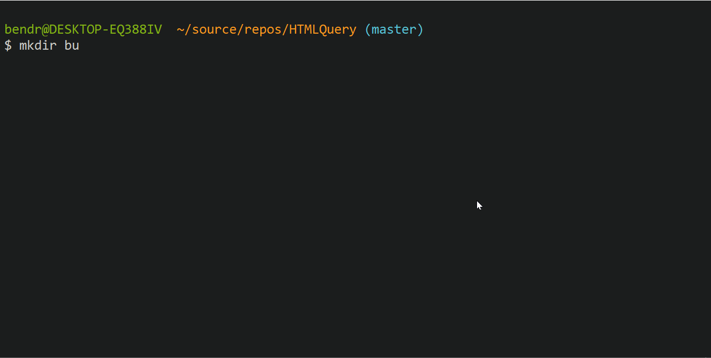
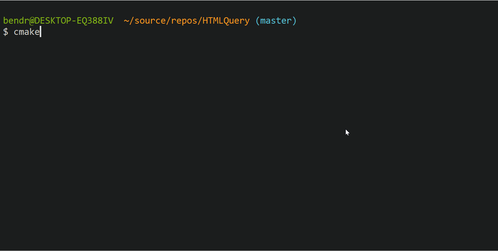
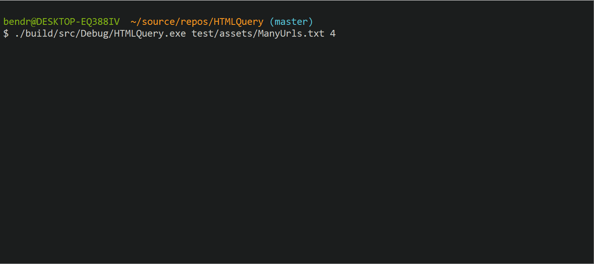

This is HTMLQuery, a multithreaded program to perform queries on url responses.

## How to build

To configure the project, from the project root:
```
mkdir build
cmake -S . -B build/ -DCMAKE_TOOLCHAIN_FILE=lib/scripts/buildsystems/vcpkg.cmake
```



Once the project is configured, build it using:
```
cmake --build build
```


## Usage

Once build, you can launch the process from the build folder with the path to a text file and number of threads.
### Example:
```
./build/src/Debug/HTMLQuery.exe test/assets/ManyUrls.txt 4
```




## Tests
Unit tests run automatically when the project is built.

## Libraries
All libraries were build and exported using vcpkg.
- gtest (version 1.11.0)
- gumbo (version 0.10.1-3)
- curl (version  7.74)